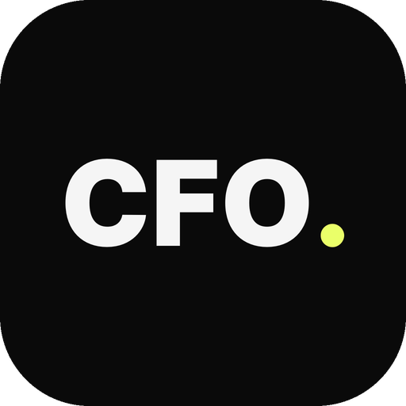

<div align="center"><a name="readme-top"></a>



# CFOnomic

**Contabilidad y control de gestión para empresas de proyectos**

</div>

ERP SaaS para PYMEs españolas de proyectos y servicios: contabilidad de partida doble sobre el PGC 2007,
analítica por proyecto, centro de coste y línea de negocio, PyG analítica, balance, cashflow, presupuesto
contra real, cierre de ejercicio y una capa de fiabilidad que verifica cada cifra antes de enseñarla.

Principio de la casa: **el LLM extrae y redacta; el código calcula.** Ninguna cifra contable sale de un
modelo — OCR → propuesta → validación determinista → asiento.

## Documentación

| Fichero | Qué es |
|---|---|
| `CLAUDE.md` | Reglas del proyecto y convenciones de código |
| `docs/SPEC-FUNCIONAL.md` | Qué se construye |
| `docs/ARQUITECTURA.md` | Multi-tenant, motor contable, capa de fiabilidad |
| `docs/MODELO-DATOS.md` | Esquema Prisma y reglas de integridad |
| `docs/spec/SPEC-FIABILIDAD.md` | Principios P1–P7 y componentes C1–C7 |
| `docs/ROADMAP.md` · `docs/ESTADO.md` | Épicas y punto de reanudación |
| `docs/deploy/` | Runbooks de despliegue (Supabase + preview) |

## Desarrollo

```bash
npm install
cp .env.example .env          # DATABASE_URL, DIRECT_URL, BETTER_AUTH_SECRET…
npx prisma migrate deploy
npm run dev                   # http://localhost:7331
```

```bash
npm run lint
npm run test                  # vitest (unitarios)
npm run test:integration      # requiere PostgreSQL
npm run test:e2e              # Playwright
npm run build
```

## Licencia y atribución

Basado en [TaxHacker](https://github.com/vas3k/TaxHacker) (Vasily Zubarev, `vas3k`), licencia MIT.
Este producto conserva esa licencia: ver [`LICENSE`](LICENSE). El motor contable, la analítica, la capa
de fiabilidad y la interfaz en español son trabajo propio de CFOnomic sobre aquel fork.

© CFOnomic · [cfonomic.com](https://cfonomic.com) · pablo@cfonomic.com
